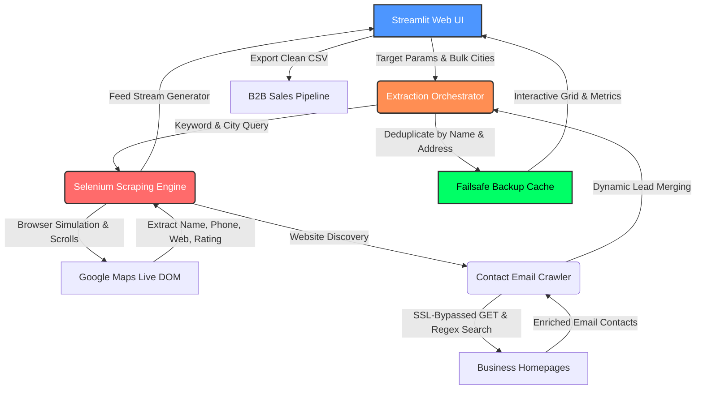

# 🗺️ MapScraper Pro: Enterprise B2B Lead Intelligence Engine
### *On-Premise. Privacy-First. Unlimited Scale.*

MapScraper Pro is a high-performance B2B lead generation proof-of-concept (PoC) designed for modern business development teams and executives who require high-quality, targeted business data without the associated security leaks or soaring subscription fees of third-party SaaS aggregators.

By marrying **headless browser automation** with **real-time contact enrichment**, MapScraper Pro enables teams to extract unlimited business profiles directly from Google Maps—completely free of API costs—while preserving absolute data privacy on local hardware.

---

## 📊 High-Level Architecture Flow

The system decouples data mining from the visualization layer, allowing for extreme scalability and optional headless integration on Linux servers.



---

## ⚡ Enterprise-Grade Capabilities

### 🔒 100% Privacy-First Architecture
In the age of strict data compliance (GDPR, CCPA), MapScraper Pro leaves zero digital footprints. All keywords, targets, and generated leads are stored purely in local RAM and written directly to your filesystem. No external third-party server ever touches your proprietary sales targets.

### 💰 Zero-Cost Google API Simulation
Bypasses the expensive official Google Maps API gateway entirely. MapScraper Pro implements intelligent, human-like Selenium scrolling and click behavior, allowing you to source unlimited directories completely free of charge.

### 📧 Automated Website Contact Crawler & SSL Hardening
If a business listing has a registered homepage, the backend activates a rapid SSL-independent HTTP crawler to search the site's text layers for valid contact emails. Built-in exclusions eliminate generic static file extensions (`.png`, `.jpg`, `.woff`) and theme defaults.

### 🛡️ Failsafe City-Boundary Caching
Large-scale campaigns crossing dozens of cities are fully protected. The controller caches deduplicated records dynamically at every city boundary cross. If the loop is cancelled or a connection drops, your data up to that second is safely retained.

---

## ⚙️ Technical Highlights & Optimization

- **Generator-Driven UI Stream:** The scraping engine acts as a Python generator, streaming live scrolling and discovery events to the UI in real time instead of blocking the main application thread.
- **Aggressive Log Rendering:** Avoids browser redraw lags by using optimized text container streams instead of parsing heavy custom HTML components in the event loop.
- **Adaptive DOM Selectors:** Features multi-layer robust selectors (CSS + XPaths) to resist structural updates in Google Maps.
- **Anti-Zombie Process Protection:** Features built-in Linux process sweeps to prevent headless instances from occupying system memory.

---

## 🚀 Quick Launch & Execution

This application has been developed to run natively in local Linux environments with automated ChromeDriver matching:

### 1. Project Directory Slide
```bash
cd ~/Documents/projects/maps_scrapper
```

### 2. Launch the Application Interface
Double-click the **MapScraper Pro** launcher on your Linux Desktop OR execute the runner manually in your shell:
```bash
./run_mapscraper.sh
```

The system will verify if an existing server is running, spin up a background headless instance if necessary, and automatically redirect your default web browser to the dashboard at:
`http://localhost:8501`

---

## 🤝 Technical Showcase Proof of Concept

This repository represents high-level engineering capabilities in:
- Automated web infrastructure simulations
- Dynamic data serialization and session-state management
- Custom multi-threaded contact crawlers
- Clean corporate web tool visual designs

*For security and privacy, local caching directories (`.wdm/`, `__pycache__/`), temporary developer scratch scripts, and virtual environment folders have been excluded.*

---

## ⚖️ Open-Source Academic Licensing & Disclaimer

This project is open-sourced under the terms of the standard **MIT License**. It is an architectural Proof of Concept (PoC) engineered strictly for local automation sandbox testing, educational research, and technical study.

* **Developer & Corporate Immunity:** This software is provided "as is", without warranty of any kind. ABT PLUS LLC (Automated Business Technologies) assumes zero liability or tracking responsibility for how third-party actors configure, clone, or deploy this open-source script.
* **Compliance Boundary:** Users bear sole individual responsibility for ensuring that their execution parameters and location lists comply with local data privacy frameworks (GDPR, CCPA) and target infrastructure Terms of Service (ToS).
* **Enterprise Production Alternatives:** For commercial-scale data pipelines, high-volume operations, or automated corporate workflows, organizations are strongly encouraged to utilize official structured channels, such as the Google Places API gateway.

---

## 📬 Contact & Corporate Information
| | |
| --- | --- |
| **Organization** | ABT PLUS LLC (Automated Business Technologies) |
| **Website** | [www.abtplusllc.com](https://www.abtplusllc.com) |
| **Support** | [support@abtplusllc.com](mailto:support@abtplusllc.com) |
| **License** | MIT — Open Source |

